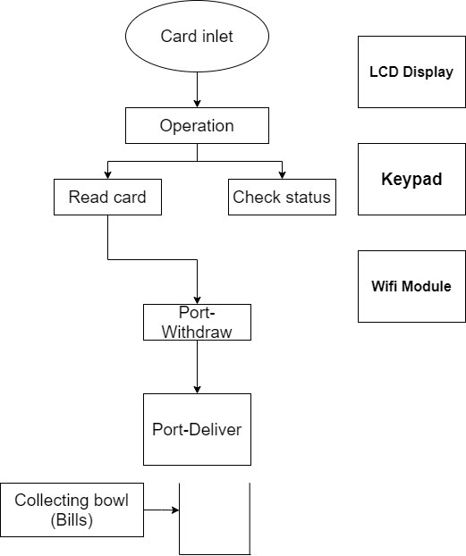
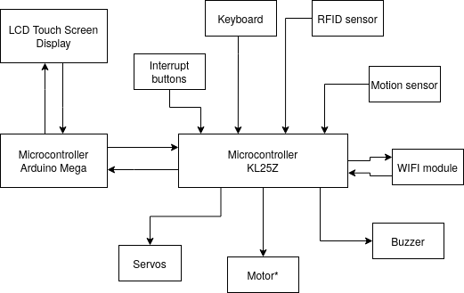

# Automated teller machine (ATM)

The design function of an ATM is to perform money withdraws and deposits whenever a customer inserts a card or types its id.
## Design steps
1. Requirements
2. Specifications
3. Hardware and software functioning

[Development kanban board](https://trello.com/b/DD39tJLS/atm-development-board)

## Requirements
When a customer inserts its card into the machine or types its account and password, and selects the operation he wants to perform.
### Inputs
- Card or keypad entry, user operation selection.
- An interrupt is generated at each port whenever a card is inserted or a keypad entry.
- A separate notification is sent to each port.

### Outputs
- Money.
- A message displayed on LCD with the transaction status.
- A message displayed on LCD with a welcome message, operations menu, time.

### System Function
- Using a graphical user interface, the customer commands to the system which operation wants to perform.
- The graphical user interface has an LCD, keypad and an LCD touch screen.
- If a withdrawal operation is selected the customer account information will be requested and displays the available money, the customer types on the keypad a valid amount and the machine dispatches the money through a servo motor.

### Design Metrics
| Design metric     | Function      |
| --------------    | --------------|
| Lifetime          | How long is the ATM expected to be in use.          |
| Reliability       | How reliable is the system? How often does the ATM work as intended?          |
| Mantainability    | The support and maintenance needed for the end client in case of technical issues.          |
| Unit cost         | The monetary cost of manufacturing each singular ATM, excluding the engineering cost.          |
| Correctness       | Our confidence that the ATM’s functionality is implemented correctly.          |
| Power consumption | The amount of power used by the ATM during operation.       |

## Specifications
The ATM performs two operations: withdrawing or checking the status account.

Depending on the user's selection, the ATM would do something different. We have the refund port (which takes care of refunding the money in a cancelation) and the withdrawal port (which takes care of giving the money to the customer in a withdrawal).

The LCD will display the respective message: “Welcome”, “Money in the account”, “How much would you like to withdraw?”, etc.

The wifi module will be used as an IoT technology which would be reading all the customer data form the cloud.

## Hardware
The ATM hardware architecture has the following hardware specifications:
- Microcontroller KL25Z
- 16 KB RAM and 4KB ROM
- Keypad
- Mechanical coin and bill sorter.
- Coin and bill channel.
- Operation channel.
- Wifi module.

## Software

## Development and contribution
- Oswaldo Hernandez | [Github](https://github.com/OSWA00) | [Twitter](https://twitter.com/oswahdez00)
- Owen Jauregui
- Marco Lopez
- Luis Sanchez
